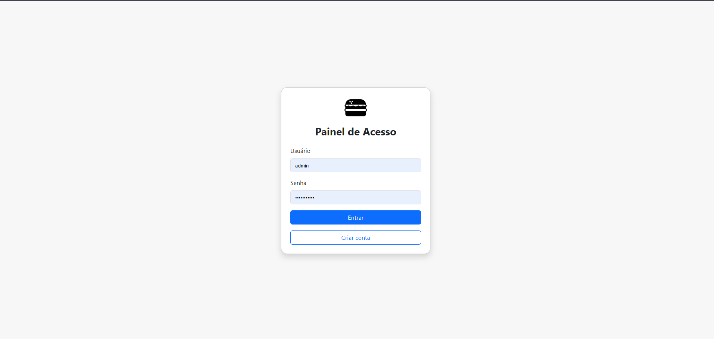
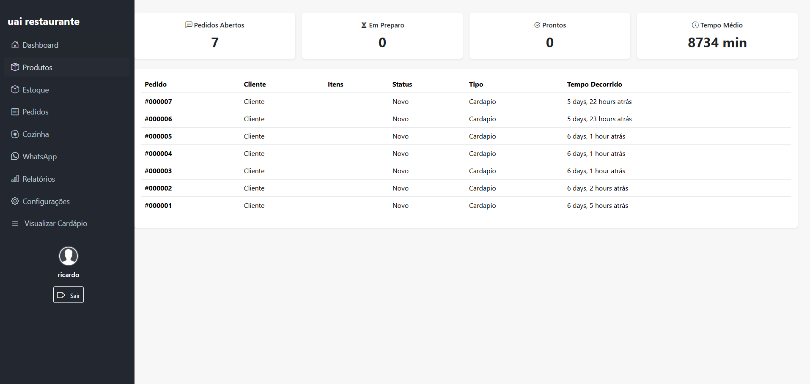
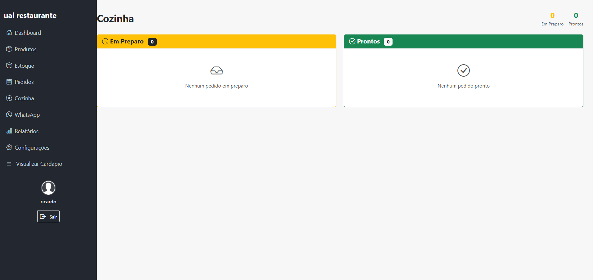
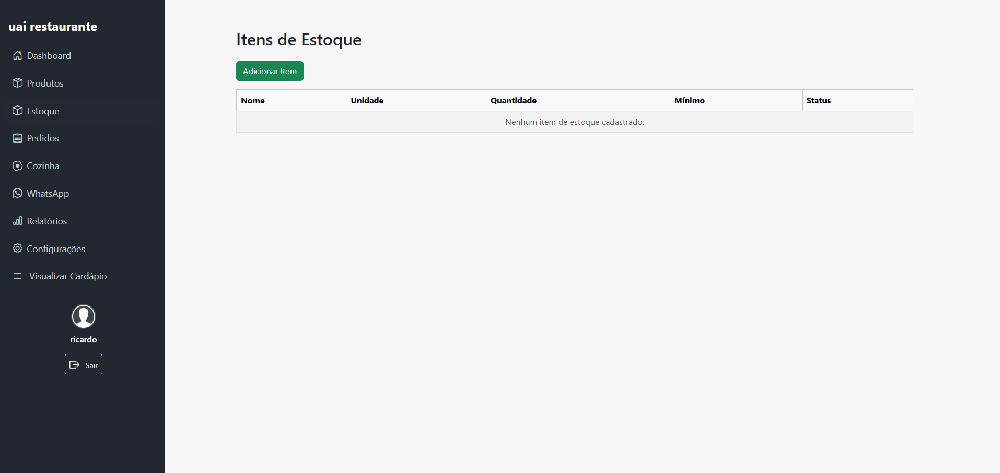
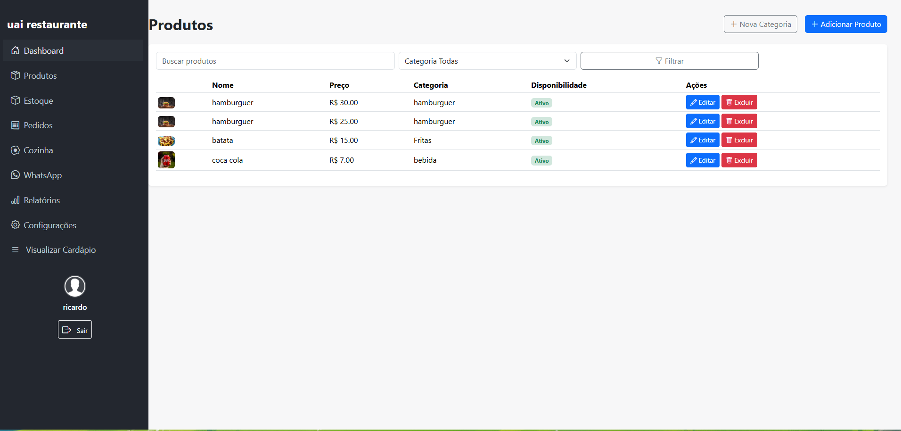
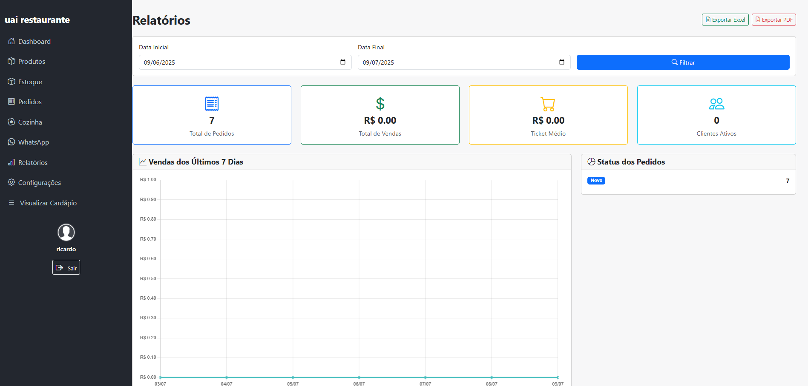

# 🍔 Delivery SaaS – Restaurant Management Platform (DEMO)

This is a public demo of a real project I've developed as a freelancer/PJ.  
The full source code is private due to confidentiality, but this repository showcases the system's features and structure.

---

## 📌 Overview

**Delivery SaaS** is a full-featured platform for managing restaurants, online ordering, and delivery operations.  
It offers functionality for both administrators and end-users, with real-time order tracking and multi-tenant support.

---

## ⚙️ Main Features

### 1. User Management & Authentication
- Login and registration for admin panel users (admin, staff, etc.)
- Customer self-registration through the online menu
- Role-based permissions and session handling for all user types

### 2. Multi-Restaurant (Tenant) Support
- Manage multiple restaurants, each with its own configuration, users, menu, and reports
- Settings include general data, opening hours, delivery methods, payment types, security and marketing configs

### 3. Online Menu
- Public-facing menu with categories, products, images, descriptions, and pricing
- Category filters and search functionality
- Cart management with addons and real-time price updates
- Modal for customer login/registration before placing orders

### 4. Product & Category Management
- CRUD operations for products with name, price, image, category, and availability
- Category and addon management (e.g. extra toppings)

### 5. Order Management
- Real-time order list with automatic updates for kitchen and admin panel
- Detailed view of order status (preparing, ready, delivered) and history
- Dedicated kitchen view for tracking current and upcoming orders

### 6. Inventory Management
- Register and track stock items
- Automatic stock deduction on order placement
- Inventory movement reports

### 7. Promotions
- Create, edit and manage discounts for specific products or categories
- Promo display integrated with the public online menu

### 8. Payment Methods
- Admin can configure available payment methods
- Customers choose payment type during checkout

### 9. Reports & Analytics
- Sales reports, top-selling products, staff performance, and more
- Analytical dashboards to support business decisions

### 10. Admin Panel & Settings
- Full admin interface to configure restaurant data, menus, inventory, users, promotions and reports
- Responsive and user-friendly UI with modals, filters and tables

### 11. WhatsApp Bot Integration
- WhatsApp bot module for automating notifications to customers and internal staff

---

## 💻 Tech Stack

- Python · Django · JavaScript · PostgreSQL · WebSocket · Docker · TailwindCSS

---

## 🖼️ Screenshots

### 🔐 Login  

### 🧭 Main Dashboard  

### 🍽️ Orders Panel  

### 👨‍🍳 Kitchen View  

### 📦 Inventory Management  

### 🛒 Product Management  

### 🧩 Configuration Panel  

### 📊 Reports (1)  

### 📊 Reports (2)  

---

## 🔒 Disclaimer

This is a **demo-only repository**. The full source code is private due to client data protection and commercial agreements.  
Feel free to reach out if you'd like to discuss the architecture or specific features in more detail.

---

## 📬 Contact

  
  

---

🚀 *Let’s build something great together.*

<!-- temporary change to force git commit -->

